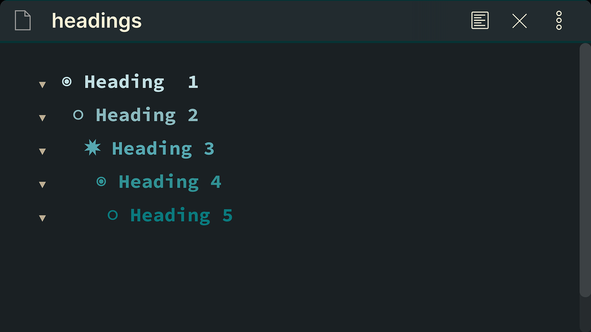
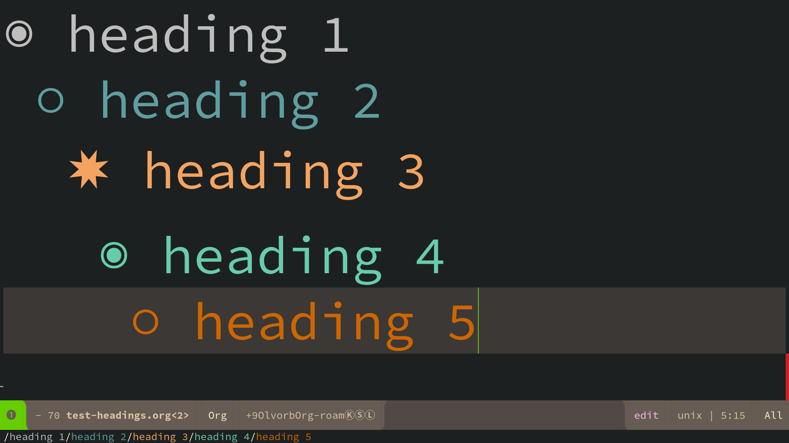
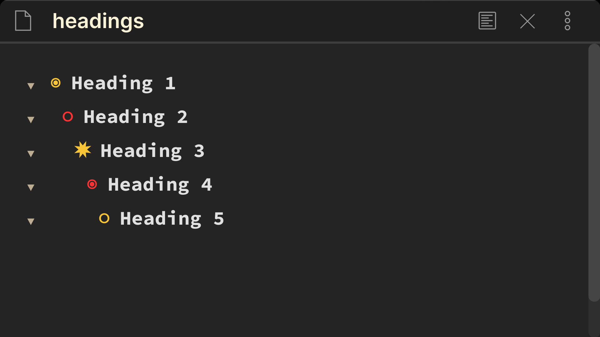

# Table of Contents

1.  [Intro](#orgc754706)
2.  [This Is What The Original Looks Like In Emacs /Spacemacs](#orgba0cfa3)
3.  [Built-in Indentation](#orga84fb04)
4.  [Installation/Set-Up](#org9a57b20)
5.  [The different versions of this code](#org88c35bf)
    1.  [Simple Version](#org5ede4d8)
        1.  [org-sidian.css](#org623baaf)
    2.  [Colored Bullet Points Version](#org2271c38)
        1.  [org-sidian-color.css](#orgbc4b49c)
6.  [Considerations](#org69c74a7)
    1.  [Same heading sizes](#org740d75b)
7.  [Special Thanks](#org422b4a7)
8.  [Additional Possible Features](#org5022959)
9.  [Versions](#org7a06980)
    1.  [Version 2.0](#org78ba570)
    2.  [Version 1.1](#org97222f9)
    3.  [Version 1.0](#org0213c1b)
    4.  [Version 0.1](#org7d78cae)

# Intro

The purpose of this code is to use css in obsidian.css to make headers look like org-mode bullet points, this is inspired by [org-bullets for org-mode](https://github.com/sabof/org-bullets).

This is what it looks like in Obsidian after adding the simple version code: <org-sidian.css>

>   Theme Used Reverie: Santi Younger (Available in the community themes)
> You can also find [Reverie on Github](https://github.com/santiyounger/Reverie-Obsidian-Theme).

This css code is meant to replace the hashtag symbol # used for headers and change it to cool UTF-8 symbols.

> Side Note: Everything I’ll talk about is for edit mode

This is what it's doing:

    H1 - instead of # display ◉
    H2 - instead of ## display ✸
    H3 - instead of ### display ✿
    H4 - instead of #### display ◉
    H5 - instead of ##### display ✸
    H6 - instead of ###### display ✿

I come from using spacemacs and I love org-mode. I moved most of my workflow to obsidian, but there’s one thing I really miss, which is org-bullet points (which adds cools symbols to headings).

# This Is What The Original Looks Like In Emacs /Spacemacs

  This screenshot is my from my Spacemacs set-up, with the original [org-bullets for org-mode](https://github.com/sabof/org-bullets).

# Built-in Indentation

There's a nice indentation with every heading (achieved through left margins in the code).

This allows for easier visualization of heading level.

It looks like this:

    ◉
     ○
      ✸
        ◉
         ○
          ✸

# Installation/Set-Up

If you know how to use obsidian snippets, you know what to do. 

If not, let me walk you thought it.

&#x2014;

Download this code by pressing the green button called Code at the top right corner.

Click on Download Zip
Once it’s in your downloads folder unzip it.

Choose either 

org-sidian-color.css 

or

org-sidian.css

Check the section the-different-versions-of-this-code
to know which one you prefer

go to your .obsidian folder and create a folder called snippets.

paste the org-sidian.css file in there.

> Keep in mind that some obsidian theme's might not be compatible.

If you want to test it, do it with my [Obsidian Theme Reverie](https://github.com/santiyounger/Reverie-Obsidian-Theme), which should work without a problem.

This also works great with my other Theme, [Wasp-Obsidian-Theme](https://github.com/santiyounger/Wasp-Obsidian-Theme) 
Both can be found in Obsidian's community themes.

# The different versions of this code

There are 2 different styles you can go for, one is \`org-sidian.css\` and the other is simply called \`org-sidian.css\`

What's the difference? you may ask, I'm glad you ask, let me tell you.

## Simple Version

### org-sidian.css

   <org-sidian.css>
This one is simple without any added colors, it will adapt to your themes heading colors better.

## Colored Bullet Points Version

### org-sidian-color.css

<org-sidian-color.css>

 This version has a yellow and red set-up. You can easily change it to your taste with hex codes.
This colored version is made to work great with my [Wasp-Obsidian-Theme](https://github.com/santiyounger/Wasp-Obsidian-Theme)  which can be found in Obsidian's community themes.

# Considerations

## Same heading sizes

This looks a lot better when all headings are the same size.
By default my theme [Reverie](https://github.com/santiyounger/Reverie-Obsidian-Theme) doesn't have same heading size, but it's fairly simple to change the code to make this possible.

Learn how to create same heading sizes from the obsidian forum:
[Make all headings same size- Obsidian Forum](https://forum.obsidian.md/t/make-all-headings-same-size-as-lvl4-heading/5962)

# Special Thanks

Special thanks to [death.au](https://forum.obsidian.md/t/hide-or-truncate-urls-in-editor-using-css/359/14). Thanks to [his code](https://forum.obsidian.md/t/hide-or-truncate-urls-in-editor-using-css/359/14) I was able to achieve this whole thing.

# Additional Possible Features

Org-mode also allows for a shortcut such as alt+→ to move headings quickly from h1 to h2 and so on. and alt+ ← to move from h2 to h1

This is something I’d like to turn into a request or if possible even develop as a plug in (perhaps as I get more advanced with JavaScript, it might be possible).

# Versions

## Version 2.0

Fixed bug that made some headings display symbols more than once in edit mode.

Now things work great in edit and preview mode.

## Version 1.1

Changed "heading 2" symbols from  "○" to "⭗" in preview mode.

## Version 1.0

Added code for preview mode.

## Version 0.1

Initial code, still to be tested with different themes and use cases.

